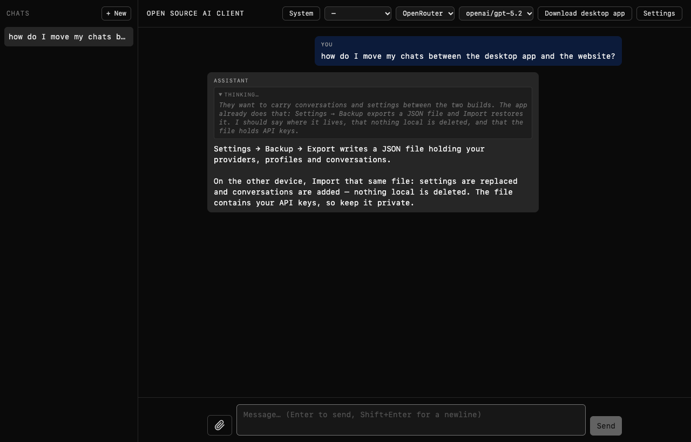
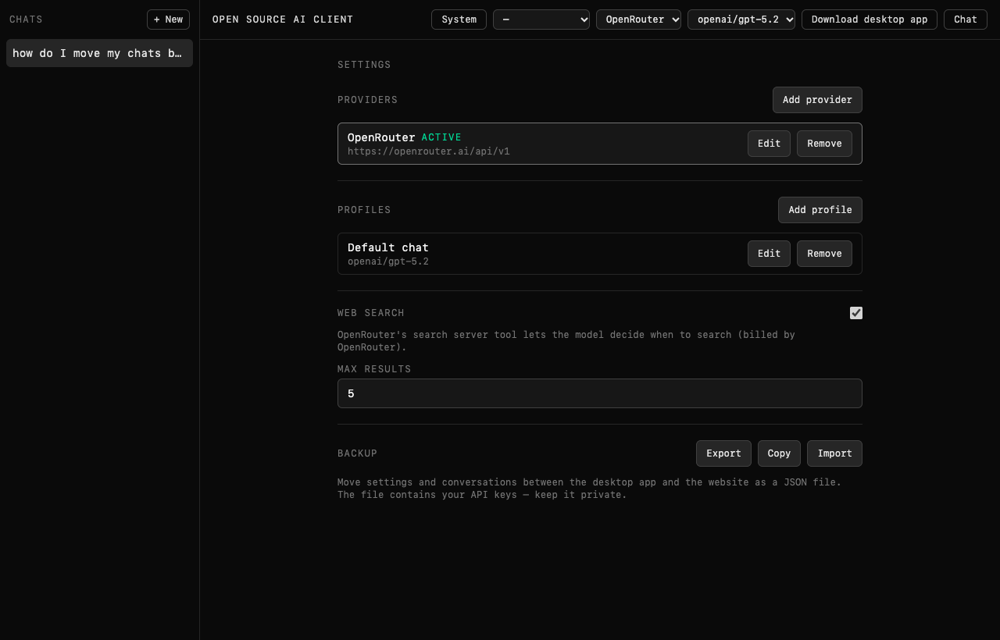

# Open Source AI Client

Desktop and web client for OpenAI-compatible and Anthropic endpoints. Tauri shell, Vite + React frontend, data stored locally.



## Highlights

- **Any OpenAI or Anthropic compatible endpoint**: no vendor lock-in.
- **Runs local models**: point it at Ollama or LM Studio and chat without a cloud account.
- **Reads pages you link**: the model can fetch a URL and answer from the page itself.
- **Small and fast**: Rust over the OS webview with no bundled browser engine, fonts or icons. ~21MB on disk.
- **Secure and private**: conversations and API keys stay on your machine, and the app has no analytics.
- **Remembers you**: durable notes the model writes as it works, plus your own, sent with every chat.
- **Updates itself**: the desktop build finds a newer release, downloads it and relaunches.
- **One codebase, two targets**: the same app ships as a desktop binary and as the website.
- **Completely open source**: GPL-3.0-only, you are free to make copies as long as they are open source.

## Download

[Releases](https://github.com/JeffreyJYZ/ai-client-oss/releases/latest) publishes macOS (universal), Windows and Linux builds. The web build runs at [aiclient.jyz.land](https://aiclient.jyz.land).

Builds are unsigned. On macOS, clear the download quarantine flag after installing, or the app will not open:

```sh
xattr -dr com.apple.quarantine "/Applications/oss-ai-client.app"
```

On Windows, SmartScreen warns: pick **More info → Run anyway**.

## Features

- Providers: OpenAI (Responses or Chat Completions), OpenRouter, OpenCode Zen, OpenCode Go, Command Code, Ollama, LM Studio, or any OpenAI-compatible base URL.
- Streaming, and a collapsible block for reasoning models' thinking.
- Web search where the endpoint provides it (OpenAI's built-in tool, or OpenRouter's `openrouter:web_search`).
- Per-conversation system prompts, and profiles bundling provider, model and prompt.
- File and image attachments.
- Export/Import moves settings and conversations between the desktop and web builds.



## Development

Needs Bun and a Rust toolchain.

```sh
cd web
bun install
bun run dev        # web
bun run tauri dev  # desktop
```

Gates: `bunx tsc -b --force`, `bunx biome check .`, `bunx effect-language-service diagnostics --project tsconfig.app.json`.

## License

GPL-3.0-only. The 0.1.x releases were published under MIT and remain MIT.
